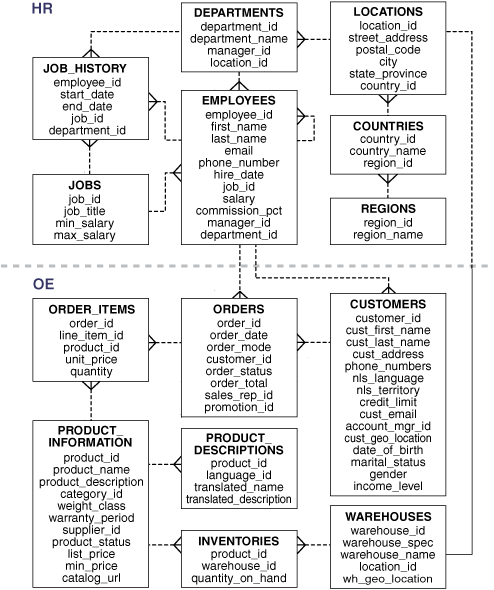
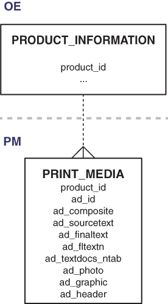
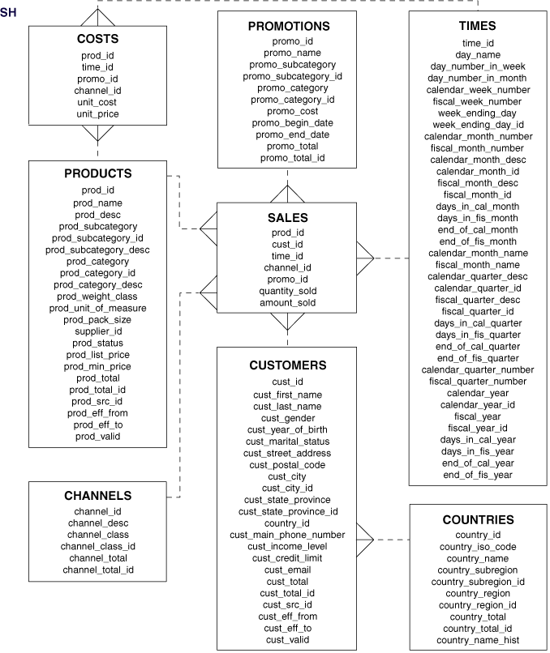
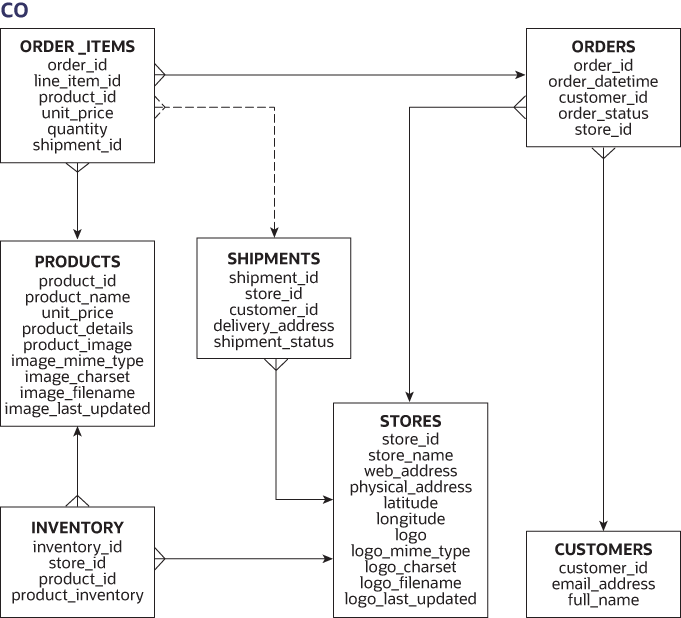

# Schema Diagrams

Oracle: [Database Sample Schemas](https://docs.oracle.com/en/database/oracle/oracle-database/21/comsc/schema-diagrams.html#GUID-D268A4DE-BA8D-428E-B47F-80519DC6EE6E)

- [HR](https://docs.oracle.com/en/database/oracle/oracle-database/21/comsc/HR-sample-schema-table-descriptions.html#GUID-506C25CE-FA5D-472A-9C4C-F9EF200823EE): human resources
- [OE](https://docs.oracle.com/en/database/oracle/oracle-database/21/comsc/OE-sample-schema-table-descriptions.html#GUID-1B906F5E-64BA-4C93-8FCC-0F3F96E9B9C1): order_entry
- [PM](https://docs.oracle.com/en/database/oracle/oracle-database/21/comsc/PM-sample-schema-table-descriptions.html#GUID-F8E24E8B-E629-417D-AA04-396395128CAE): product_media
- [IX](https://docs.oracle.com/en/database/oracle/oracle-database/21/comsc/IX-sample-schema-table-descriptions.html#GUID-8179FABC-89DA-4A0C-95F5-E392CCA2313B): info_exchange
- [SH](https://docs.oracle.com/en/database/oracle/oracle-database/21/comsc/SH-sample-schema-table-descriptions.html#GUID-537FD098-CB66-4436-A36F-2500698E5B58): shipping
- [CO](https://docs.oracle.com/en/database/oracle/oracle-database/21/comsc/co-table-desciptions.html#GUID-34FF2738-98FA-4E9C-9F5C-FF395C8DBDF7): customer_orders

## Sample Schemas HR and OE

## Sample Schemas OE and PM

## Sample Schema SH

## Sample Schema CO

